<!-- DO NOT EDIT THIS FILE; it is auto-generated from readme.txt -->
# AMP Plugin for WordPress

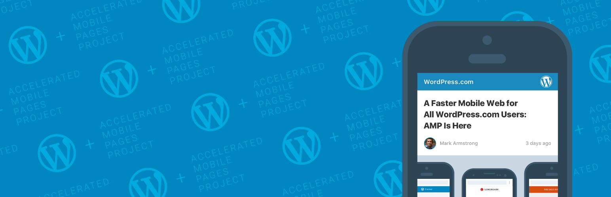
Official AMP plugin, supported by the AMP team. Formerly Accelerated Mobile Pages, AMP enables great experiences across both mobile and desktop.

**Contributors:** [google](https://profiles.wordpress.org/google), [xwp](https://profiles.wordpress.org/xwp), [automattic](https://profiles.wordpress.org/automattic), [westonruter](https://profiles.wordpress.org/westonruter), [albertomedina](https://profiles.wordpress.org/albertomedina), [schlessera](https://profiles.wordpress.org/schlessera), [swissspidy](https://profiles.wordpress.org/swissspidy), [pierlo](https://profiles.wordpress.org/pierlo), [ryankienstra](https://profiles.wordpress.org/ryankienstra)  
**Tags:** [amp](https://wordpress.org/plugins/tags/amp), [mobile](https://wordpress.org/plugins/tags/mobile), [optimization](https://wordpress.org/plugins/tags/optimization), [accelerated mobile pages](https://wordpress.org/plugins/tags/accelerated-mobile-pages), [framework](https://wordpress.org/plugins/tags/framework), [components](https://wordpress.org/plugins/tags/components), [blocks](https://wordpress.org/plugins/tags/blocks), [performance](https://wordpress.org/plugins/tags/performance), [ux](https://wordpress.org/plugins/tags/ux), [seo](https://wordpress.org/plugins/tags/seo), [official](https://wordpress.org/plugins/tags/official)  
**Requires at least:** 4.9  
**Tested up to:** 5.4  
**Stable tag:** 1.5.1  
**License:** [GPLv2 or later](http://www.gnu.org/licenses/gpl-2.0.html)  
**Requires PHP:** 5.6  

   

## Description ##

The [AMP Project](http://amp.dev) is an open-source initiative aiming to make the web better for all. AMP enables web experiences that are consistently fast, beautiful and high-performing across distribution platforms. AMP formerly stood for “Accelerated Mobile Pages”, but now works completely across desktop and mobile. The official AMP plugin for WordPress supports fully integrated AMP publishing for WordPress sites, with robust capabilities and granular publisher controls.

Features and capabilities provided by the plugin include:

- **AMP-first Experiences**: enabling [full-site AMP experiences](https://amp.dev/about/websites) without sacrificing the flexibility of the platform or the fidelity of content.
- **Core Theme Support**: enabling AMP compatibility for all core themes, from Twenty Ten all the way through Twenty Twenty.
- **Compatibility Tool**: when automatic conversion of markup to AMP is not possible, debug AMP validation errors with detailed information including the invalid markup and the specific components responsible on site (e.g theme, plugin, embed); validation errors are shown contextually with their respective blocks in the editor.
- **CSS Tree Shaking**: automatically remove the majority of unused CSS to bring the total under AMP's 75KB limit; when the total after tree shaking is still over this limit, prioritization is used so that the all-important theme stylesheet important is retained, leaving less important ones to be excluded (e.g. print styles).

Please note that the [Stories](https://amp.dev/about/stories) experience has been removed from the AMP plugin in favor of the feature being released as a standalone plugin. It will be available soon!

The plugin can be configured to follow one of three different template modes: Standard, Transitional, and Reader. In Standard mode you use AMP as the framework for your site, and there need not be any separate AMP and non-AMP versions. When configured to operate in Reader and Transitional modes, a given page will have a canonical URL as well as a corresponding (paired) AMP URL. The AMP plugin is not serving as a mobile theme; it does not redirect mobile devices to the AMP version. Instead, the AMP version is served to mobile visitors when they find the content on platforms such as Twitter, Pinterest, Google Search, and others. Reader mode only supports serving AMP for singular posts, pages, and other post types, whereas Standard and Transitional mode support serving the entire site as AMP.

With the official AMP plugin for WordPress, the WordPress ecosystem is provided with the capabilities and tools it needs to build world-class AMP experiences without deviating from its standard, flexible, and well-known content creation workflow.

## Frequently Asked Questions ##

Please see the [FAQs on amp-wp.org](https://amp-wp.org/documentation/frequently-asked-questions/). Don't see an answer to your question? Please [search the support forum](https://wordpress.org/support/plugin/amp/) to see if someone has asked your question. Otherwise, please [open a new support topic](https://wordpress.org/support/plugin/amp/#new-post).

## Installation ##

1. Upload the folder to the `/wp-content/plugins/` directory.
2. Activate the plugin through the 'Plugins' menu in WordPress.
3. If you currently use older versions of the plugin in `Reader` mode, it is strongly encouraged to migrate to `Transitional` or `Standard` mode. Depending on your theme/plugins, some development work may be required.

## Getting Started ##

To learn more about the plugin and start leveraging its capabilities to power your AMP content creation workflow check [the official AMP plugin product site](https://amp-wp.org).

If you are a developer, we encourage you to [follow along](https://github.com/ampproject/amp-wp) or [contribute](https://github.com/ampproject/amp-wp/blob/develop/contributing.md) to the development of this plugin on GitHub.

## Screenshots ##

### In the website experience, theme support enables you to reuse the active theme's templates and stylesheets; all WordPress features (menus, widgets, comments) are available in AMP.

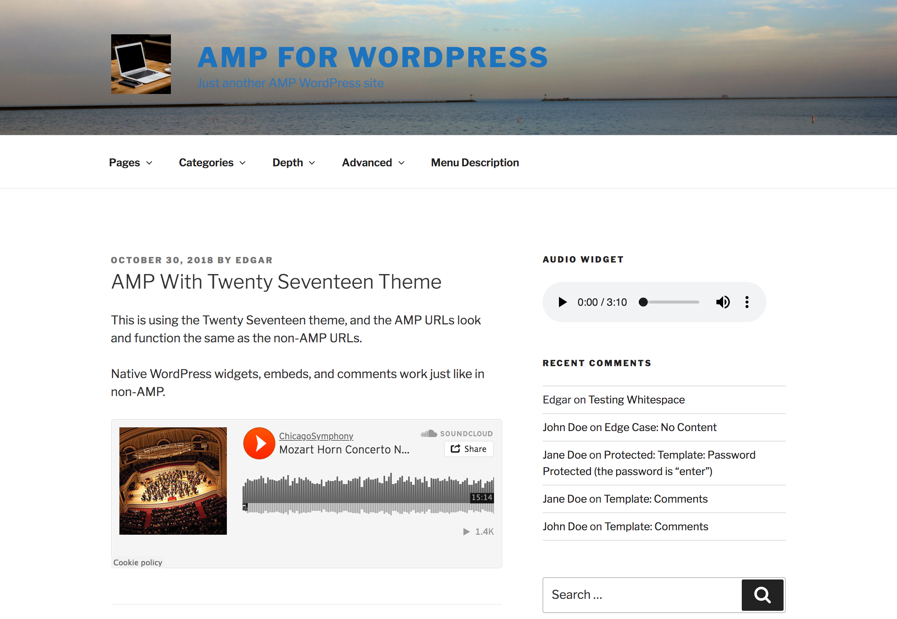

### All core themes are supported, and many themes can be served as AMP with minimal changes, Otherwise, behavior is often as if JavaScript is turned off in the browser since scripts are removed.

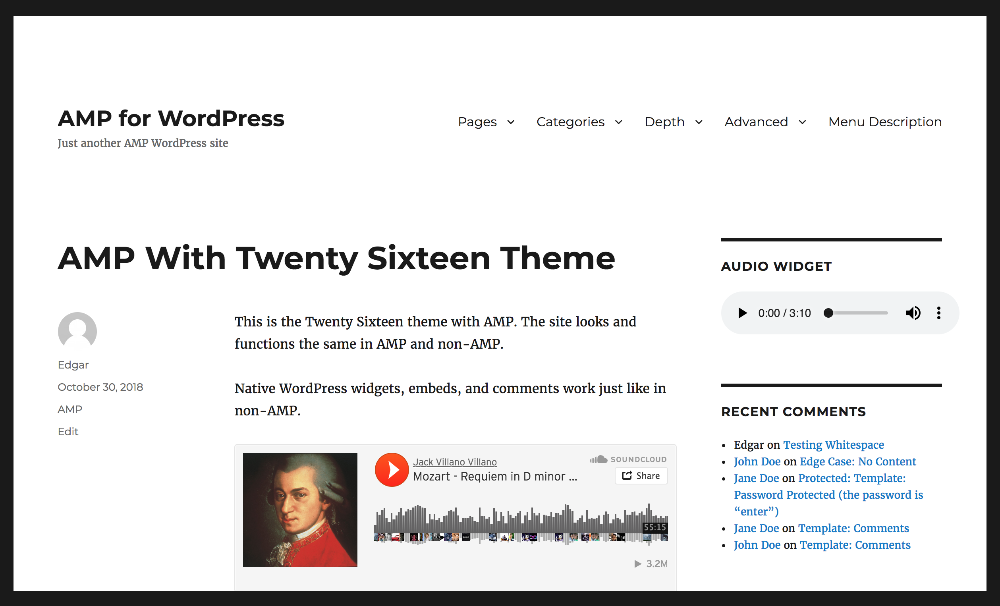

### Reader mode templates are still available, but they differ from the active theme.

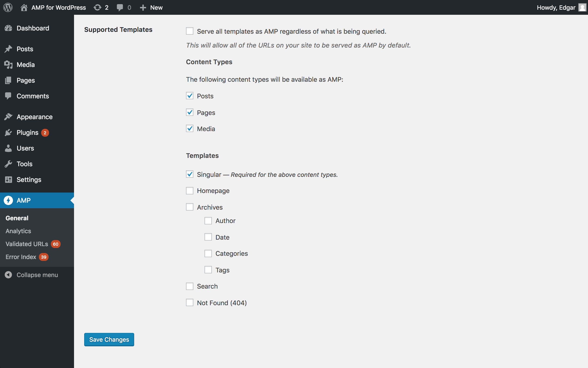

### Switch from Reader mode to Transitional or Standard mode in AMP settings screen.

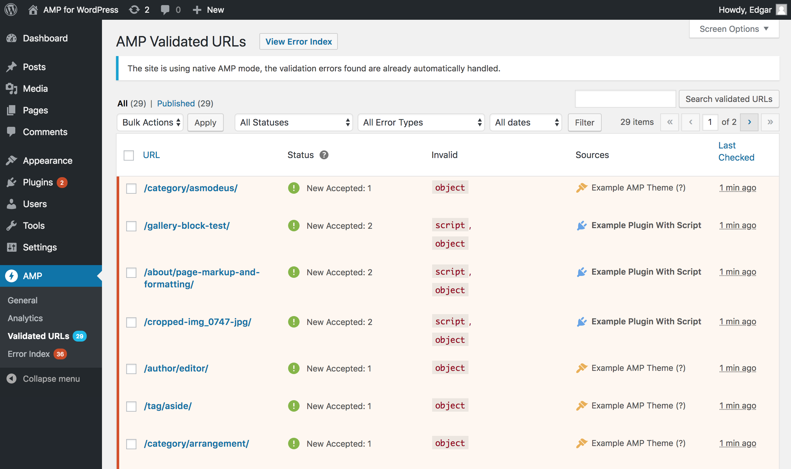

### Standard mode: Using AMP as the framework for your site, not having to maintain an AMP and non-AMP version. Mobile and desktop users get same experience.

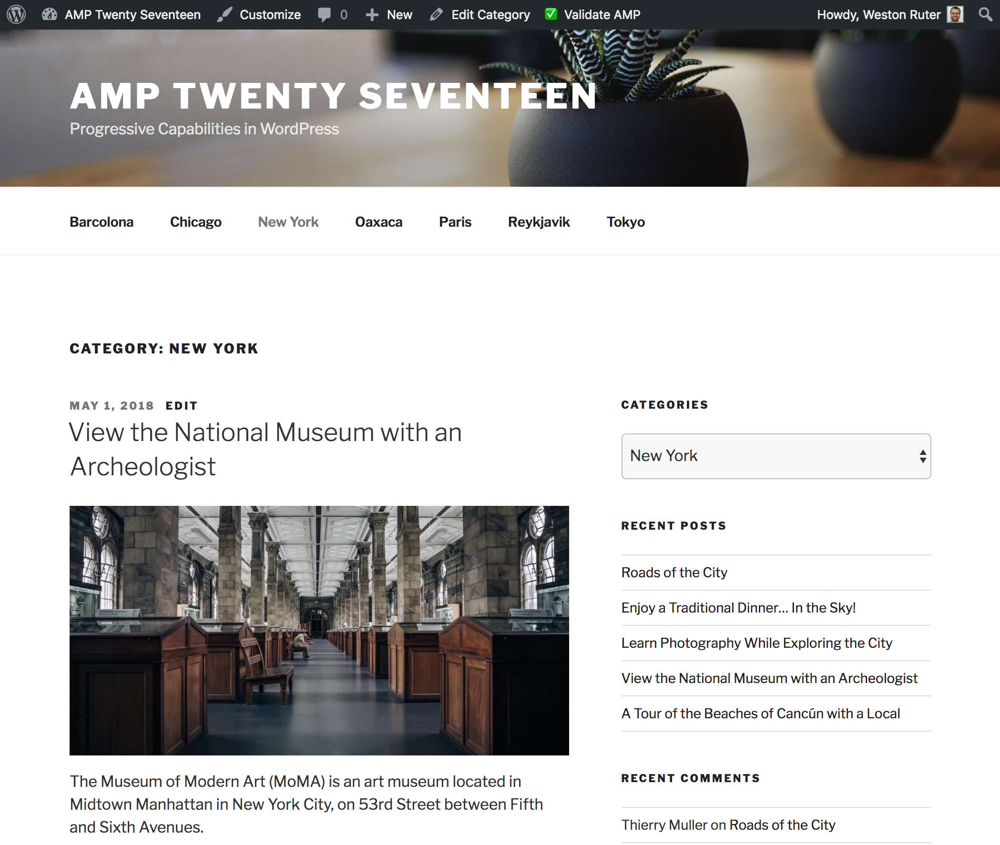

### Transitional mode: A path to making your site fully AMP-compatible, with tools to assist with debugging validation issues along the way.

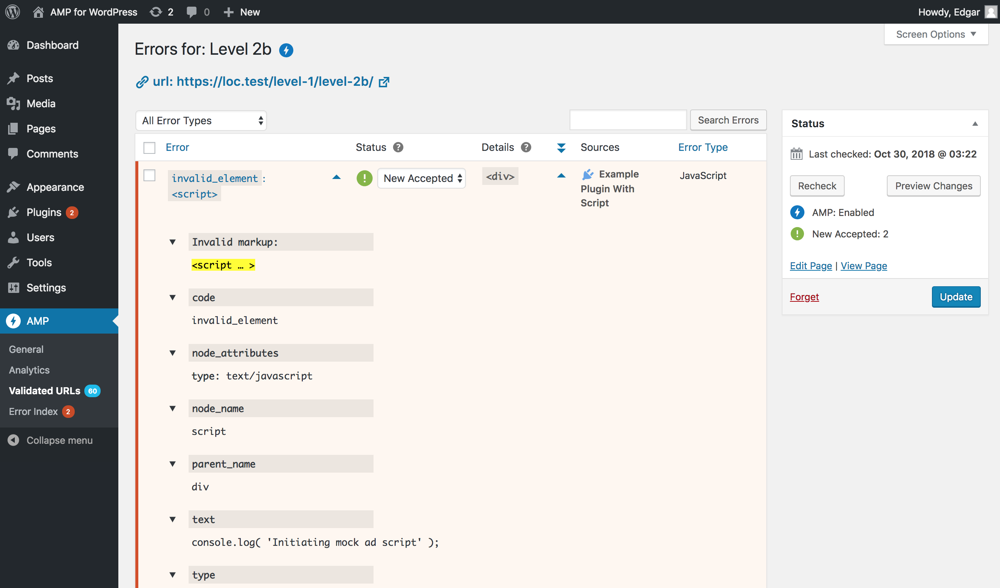

### Make the entire site available in AMP or pick specific post types and templates; you can also opt-out on per-post basis.

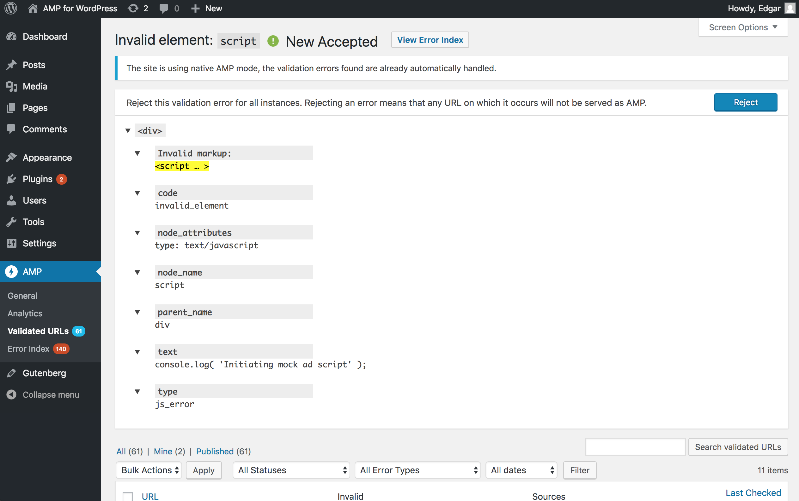

### Plugin checks for AMP validity and will indicate when: no issues are found, new issues need review, or issues block AMP from being served.

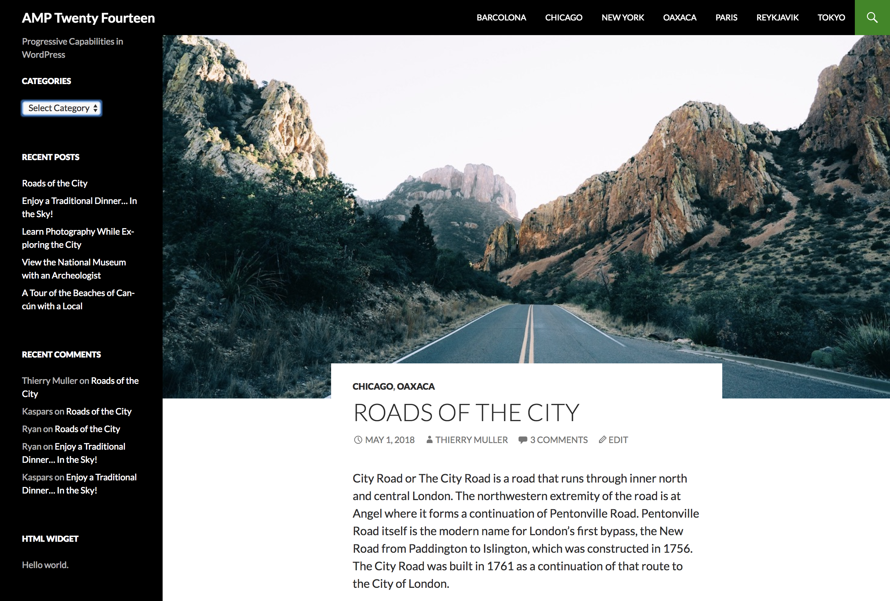

### The editor will surface validation issues during content authoring. The specific blocks with validation errors are indicated.

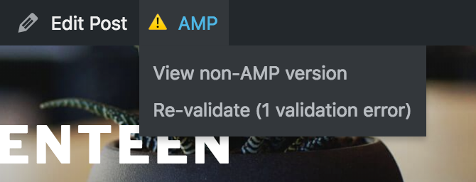

### Each Validated URL shows the list of validation errors encountered, giving control over whether invalid markup is removed or kept. Keeping invalid markup disables AMP.

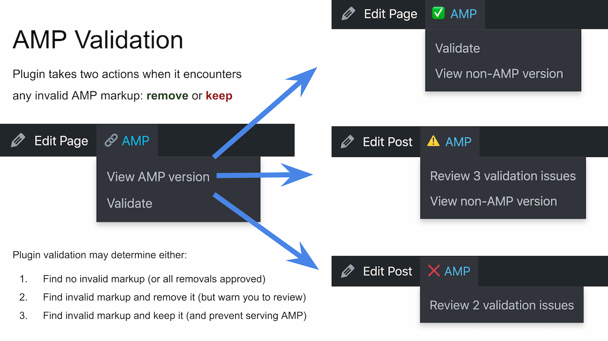

### Each validation error provides a stack trace to identify which code is responsible for the invalid markup, whether a theme, plugin, embed, content block, and so on.

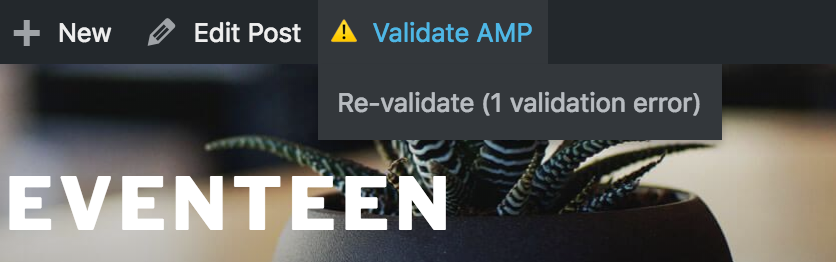

### Styles added by themes and plugins are automatically concatenated, minified, and tree-shaken to try to keep the total under 75KB of inline CSS.

### A WP-CLI command is provided to check the URLs on a site for AMP validity. Results are available in the admin for inspection.

## Changelog ##

For the plugin’s changelog, please see [the Releases page on GitHub](https://github.com/ampproject/amp-wp/releases).

